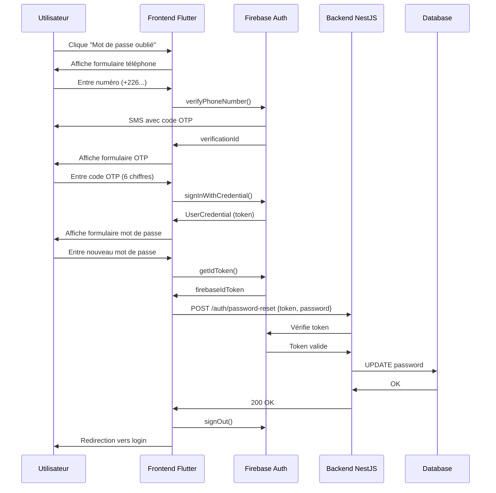

# Implémentation de la Réinitialisation de Mot de Passe

## Vue d'ensemble

Cette fonctionnalité permet aux utilisateurs de réinitialiser leur mot de passe en utilisant Firebase Authentication pour la vérification par SMS/OTP.

## Architecture

### Frontend (Flutter)
- **Page**: `lib/auth/forgot_password_page.dart`
- **Intégration**: Ajoutée dans `lib/loginScreen.dart`

### Backend (NestJS)
- **Endpoint**: `POST /auth/password-reset`
- **DTO**: `ResetPasswordFirebaseDto`

## Processus en 3 Étapes

### Étape 1: Saisie du Numéro de Téléphone
1. L'utilisateur entre son numéro au format international (+226XXXXXXXX)
2. Validation du format (expression régulière)
3. Envoi de la requête à Firebase Auth via `verifyPhoneNumber()`
4. Firebase envoie un code OTP par SMS

**Méthode clé**: `_sendOTP()`

```dart
await _auth.verifyPhoneNumber(
  phoneNumber: phoneNumber,
  codeSent: (String verificationId, int? resendToken) {
    // Stockage du verificationId pour l'étape suivante
  },
  // ... autres callbacks
);
```

### Étape 2: Vérification du Code OTP
1. L'utilisateur saisit le code à 6 chiffres reçu par SMS
2. Création des credentials Firebase avec le code
3. Connexion temporaire à Firebase pour valider le code
4. Si le code est valide, passage à l'étape 3

**Méthode clé**: `_verifyOTP()`

```dart
final PhoneAuthCredential credential = PhoneAuthProvider.credential(
  verificationId: _verificationId!,
  smsCode: otp,
);
final UserCredential userCredential = await _auth.signInWithCredential(credential);
```

### Étape 3: Création du Nouveau Mot de Passe
1. L'utilisateur crée un nouveau mot de passe (minimum 8 caractères)
2. Récupération du token Firebase ID de l'utilisateur connecté
3. Envoi au backend avec le token et le nouveau mot de passe
4. Le backend vérifie le token Firebase et met à jour le mot de passe
5. Déconnexion de Firebase et retour à la page de connexion

**Méthode clé**: `_resetPassword()`

```dart
final String firebaseIdToken = await user.getIdToken();
final response = await ApiService.post(
  '/auth/password-reset',
  {
    'firebaseIdToken': firebaseIdToken,
    'newPassword': _newPasswordController.text,
  },
);
```

## Dépendances Ajoutées

### pubspec.yaml
```yaml
dependencies:
  firebase_core: ^3.8.1
  firebase_auth: ^5.3.3
```

## Configuration Requise

### Firebase Console
1. Créer un projet Firebase
2. Activer l'authentification par téléphone
3. Configurer les applications (Android/iOS)
4. Télécharger les fichiers de configuration:
   - Android: `google-services.json` → `android/app/`
   - iOS: `GoogleService-Info.plist` → `ios/Runner/`

### Android (android/app/build.gradle)
```gradle
dependencies {
    // ... autres dépendances
    implementation platform('com.google.firebase:firebase-bom:32.7.0')
}
```

### iOS (ios/Podfile)
```ruby
platform :ios, '13.0'
```

### Initialisation Firebase (main.dart)
```dart
import 'package:firebase_core/firebase_core.dart';

void main() async {
  WidgetsFlutterBinding.ensureInitialized();
  await Firebase.initializeApp();
  runApp(MyApp());
}
```

## Sécurité

### Frontend
- ✅ Validation stricte du format de téléphone
- ✅ Code OTP à 6 chiffres uniquement
- ✅ Mot de passe minimum 8 caractères
- ✅ Confirmation de mot de passe
- ✅ Gestion des erreurs Firebase (limite de tentatives, code expiré, etc.)

### Backend
- ✅ Vérification du token Firebase ID
- ✅ Validation du DTO avec class-validator
- ✅ Pas de stockage du code OTP côté backend (géré par Firebase)

## Interface Utilisateur

### Design
- Indicateur de progression (3 barres)
- Transitions fluides entre les étapes (PageView)
- Champs OTP individuels avec auto-focus
- Bouton "Renvoyer le code"
- Indicateurs de chargement
- Messages d'erreur clairs

### Couleurs
- Primaire: `#5ac18e` (vert)
- Secondaire: `#8D8D8D` (gris foncé)
- Erreur: Rouge
- Succès: Vert

## Gestion des Erreurs

### Erreurs Firebase
| Code | Message Utilisateur |
|------|-------------------|
| `invalid-phone-number` | Le numéro de téléphone est invalide |
| `too-many-requests` | Trop de tentatives. Réessayez plus tard |
| `invalid-verification-code` | Le code saisi est incorrect |
| `session-expired` | Le code a expiré. Veuillez en demander un nouveau |

### Erreurs Backend
- `400`: Données invalides (validation DTO)
- `401`: Token Firebase invalide
- `500`: Erreur serveur

## Flux Complet



## Fonctionnalités Additionnelles

### Renvoyer le Code OTP
- Utilise `forceResendingToken` pour permettre un nouvel envoi
- Limite imposée par Firebase pour éviter les abus
- Bouton activé après l'envoi initial

### Navigation
- Bouton retour pour annuler le processus
- Transitions entre étapes non reversibles (sécurité)
- Retour automatique à la page de connexion après succès

## Tests Recommandés

### Tests Unitaires
- [ ] Validation du format de téléphone
- [ ] Validation du code OTP (6 chiffres)
- [ ] Validation du mot de passe (8+ caractères)
- [ ] Correspondance des mots de passe

### Tests d'Intégration
- [ ] Envoi du code OTP
- [ ] Vérification du code OTP
- [ ] Réinitialisation du mot de passe
- [ ] Gestion des erreurs Firebase
- [ ] Gestion des erreurs Backend

### Tests E2E
- [ ] Flux complet de réinitialisation
- [ ] Renvoyer le code OTP
- [ ] Code OTP invalide
- [ ] Code OTP expiré
- [ ] Connexion après réinitialisation

## Maintenance

### Logs
- `debugPrint()` pour les événements Firebase
- Logs backend pour les tentatives de réinitialisation
- Monitoring des erreurs

### Métriques Recommandées
- Nombre de réinitialisations par jour
- Taux d'échec (code invalide, expiré)
- Temps moyen du processus
- Abandons par étape

## Support

### Numéros Supportés
- Format international obligatoire (+XXX...)
- Auto-ajout de l'indicatif si manquant (+226 pour Burkina Faso)
- Validation stricte du format

### Limites Firebase
- **Quotas gratuits**: 10,000 vérifications/mois
- **Rate limiting**: Par IP et par numéro
- **Timeout**: 60 secondes par code

## Migration Future

### Améliorations Possibles
1. **reCAPTCHA Web**: Protection anti-spam pour le web
2. **Authentification multi-facteur**: Option 2FA
3. **Email de notification**: Confirmation de changement de mot de passe
4. **Historique**: Log des changements de mot de passe
5. **Questions de sécurité**: Vérification additionnelle
6. **Biométrie**: Touch ID / Face ID pour validation
